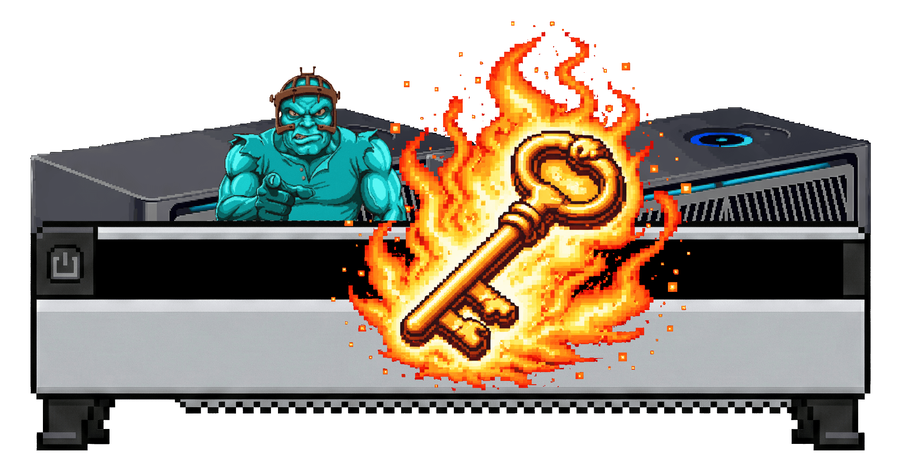

<h1 align="center">Thermal Key</h1>

<p align="center">
  <strong>Local-first CLI control for Avalon Mini 3 and Nano 3S miners</strong><br>
  Monitor, automate, and manage fleets without vendor apps or cloud logins.
</p>

<p align="center">
  <a href="#quick-start"></a>
  <a href="#command-highlights"></a>
  
  
  
  <a href="https://x.com/marsmensch"></a>
  <a href="https://github.com/mars-llm/thermal-key"></a>
  <a href="https://mars-llm.github.io/thermal-key/"></a>
</p>

<p align="center">
  
</p>

---

## What Thermal Key does

- Real-time status: hashrate, temperature, fan, power, uptime
- Fleet control: run the same command across many IPs in parallel
- Safe controls: reboot, fan, mode, frequency, pool switching
- Web UI auth tools: create auth cookies and retrieve hashes
- Raw CGMiner access when you need full control

## Why local-first

<table>
<tr>
<td width="50%">

### Vendor app
- Cloud account required
- Phone only
- One device at a time
- No scripting
- Locked out? Contact support

</td>
<td width="50%">

### Thermal Key
- 100% local
- Any terminal, any platform
- Fleet management built-in
- Automate everything
- Recover access yourself

</td>
</tr>
</table>

> Safety note: miners can overheat or be damaged by wrong settings. Use conservative limits and monitor temperatures.

## Supported hardware

- Avalon Mini 3
- Avalon Nano 3S

## Quick start

You need Python 3.8+ and the miner IP address.

```bash
git clone https://github.com/mars-llm/thermal-key.git
cd thermal-key

python3 thermal.py -H 192.168.1.100 status
python3 thermal.py -H 192.168.1.100 watch
```

## Screenshots

<p align="center">
  
</p>

## Command highlights

| Category | Commands | Notes |
| --- | --- | --- |
| Status | `thermal.py -H IP status` | Full device status |
| Live view | `thermal.py -H IP watch` | Real-time monitoring |
| Pools | `thermal.py -H IP pools` | List pool configuration |
| Fan | `thermal.py -H IP fan 80` | 15-100 or `auto` |
| Mode | `thermal.py -H IP mode 1` | 0=Heater, 1=Mining, 2=Night |
| Frequency | `thermal.py -H IP freq 500` | MHz setting |
| Pool switch | `thermal.py -H IP switchpool 0` | Activate pool index |
| Auth | `thermal.py -H IP auth PASSWORD` | Web UI auth cookie |
| Recovery | `thermal.py -H IP getauth` | Retrieve auth hash |
| Raw API | `thermal.py -H IP raw COMMAND` | CGMiner API passthrough |

## Fleet workflows

```bash
python3 thermal.py -H 192.168.1.100,192.168.1.101,192.168.1.102 status
```

```
HOST             HASHRATE   TEMP   FAN  POWER   M  UPTIME
----------------------------------------------------------------------
192.168.1.100      40.1 TH/s   63C  100%  1215W   M  2h 15m
192.168.1.101      39.8 TH/s   61C  100%  1210W   M  5h 30m
192.168.1.102      OFFLINE
```

## Web UI auth and recovery

If you are locked out of the web UI, you can retrieve the auth hash with:

```bash
thermal.py -H IP getauth
```

Then use the optional recovery helper:

```bash
python3 password.py -d IP -w wordlist.txt
```

## Security notice

The CGMiner API on port 4028 has no authentication. Anyone on your network can control your miner.

Recommendations:
- Isolate miners on a dedicated VLAN
- Firewall port 4028 from untrusted networks
- Use a strong web UI password

## Testing

```bash
./scripts/test.sh
```

If devices are offline, you can skip them:

```bash
TK_SKIP_OFFLINE=1 ./scripts/test.sh
```

## Website

The project homepage is published from `docs/` via GitHub Pages.

## Socials

- X: https://x.com/marsmensch
- GitHub: https://github.com/mars-llm/thermal-key
- Homepage: https://mars-llm.github.io/thermal-key/

## License

MIT - See [LICENSE](LICENSE)
